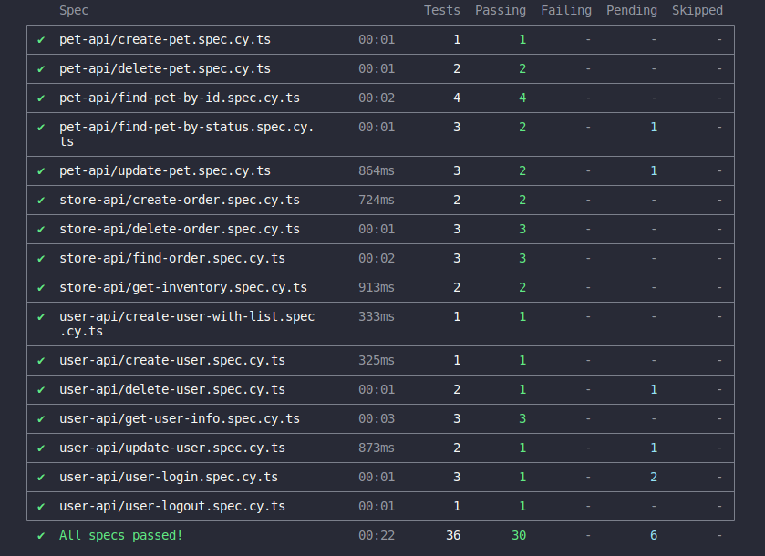
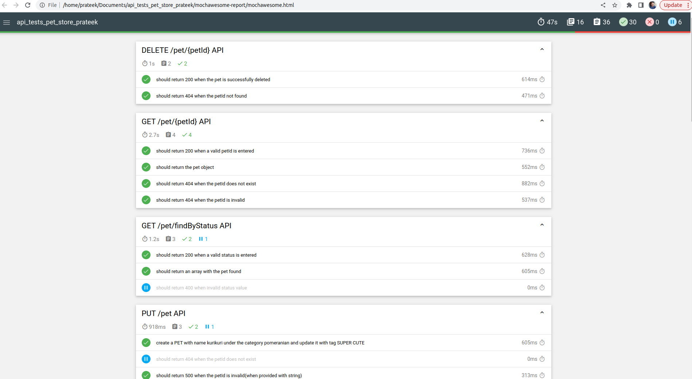
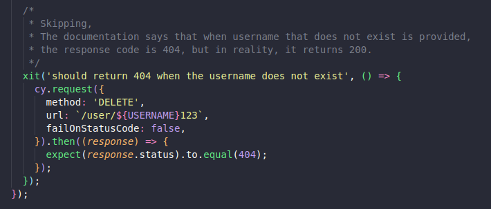
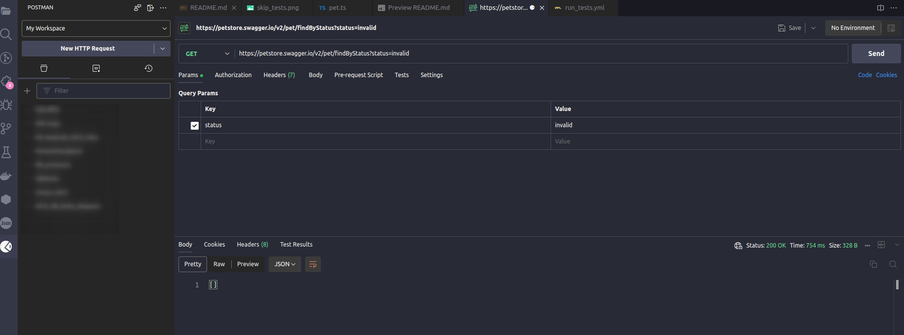

# Cypress API Tests framework using typescript

This readme explains the installation and usgae of the API testing framework developed using [Cypress](https://docs.cypress.io/guides/getting-started/installing-cypress) in TypeScript.

## Contents

- [Introduction](#markdown-header-introduction)
- [Installation](#markdown-header-installation)
- [Usage](#markdown-header-usage)
- [Reporting](#markdown-header-reporting)
- [CI&CD](#markdown-header-cicd)
- [Issues](#markdown-header-issues)
- [Improvements](#markdown-header-improvements)
- [Scenarios](#markdown-header-scenarios)

## Introduction

The framework is designed using Cypress and TypeScript. The tests cases written covers most of the cases for Application Under Test(AUT).
Cypress Commands,utilities and fixtures are used wherever required. It utilize Cypress's powerful API testing capabilities to ensure the proper functioning of backend services.

## Installation 

Download the folder and unzip it. 
Run `npm install` to install all the necessary and related dependencies.

** Please check for node modules on your machine. This project will however make  sure that all the dependencies are installed without any failure. Since , Cypress uses node.js server to execute tests, node modules are required.
** If you have any conflicts related to node.js version, please upgrade the version or use virtual environment.

## Usage

Once your project is set up and all the dependencies are installed without failure. You can run your tests now. 
But before jumping directly on how to run the tests, let us understand about the structure of the project.

- Folder Structure 
```
API_TESTS_PET_STORE_PRATEEK/
├── .github/workflows/
│   └── run_tests.yml : To run the tests using GitHub Actions
├── cypress/
│   ├── constants : contains all the necessary constants used in tests/
│   │   ├── index.ts : used for exports
│   │   ├── order.ts : Represents an order for a pet
│   │   └── pet.ts : Represents pet available to POST
│   ├── downloads : will contain all the videos/screenshots and necessary artifacts
│   ├── e2e : all the tests are written here as specs/
│   │   ├── pet-api : all the specs/tests related to PET Api
│   │   ├── store-api : all the specs/tests related to STORE Api
│   │   └── user-api : all the specs/tests related to USER Api
│   ├── fixtures : contains fixtures (not applicable in this framework)
│   ├── results: contains mochawesome .json reports
│   ├── support : contains custom commands/
│   │   ├── commands.ts : contains custom commands and previously known index.d.ts
│   │   ├── customLogger.ts : customized logger created for adding logs at various levels
│   │   ├── e2e.ts
│   │   └── generate_random_username.ts : function for generating 6 letters username
│   ├── types/
│   │   ├── index.ts : for exports
│   │   ├── order-interface.ts : contains interface for order set
│   │   └── pet-interface.ts : contains interface for pet
│   └── tsconfig.json : for using typescript in cypress
├── node_modules : contains module for nodes and cypress. Should be added to .gitignore
├── .eslintrc : for linting
├── .gitignore : for not commiting unecessary codes like videos,screenshots, node modules
├── .prettierrc : used to configure the behavior of the Prettier code formatting tool
├── cypress.config.ts : contains configuration options for cypress, base url etc
├── package-lock.json : autogenerated
├── package.json : conatins scripts to run test, open cypress, depenedencies, versions etc
└── README.md : readme for installations and usage
```

### Run using command line

If you want to run your tests using command line, please use the following command

```
    Open your terminal
    cd to the project folder
    Run : npm run test 
```
The above will collect all the tests and runs them. After the tests are completed, a report will be published on your terminal giving user an overview about the tests runs and statuses.

## Reporting

When running your tests locally(using CLI), a report will be automatically published on the terminal 
 


Although `mochawesome` is used in this project for reporting. Please follow these steps to generate the report

```
1. cd /to/your/project
2. run `npm run test`
3. combine using mochawesome-merge : npx mochawesome-merge "cypress/results/*.json" > mochawesome.json
4. generate a combined json : npx marge mochawesome.json
5. Drop the generated file to the browser
```


## CI using Github Actions

GitHub actions are used to run your tests when a PR is pushed to a branch. 
run_tests.yml is created to utilize the flow. 

## Issues

While exploring the application, some issues are observed. Listing them for reference:

For some negative cases, documentation says error code 404 or 400 should be returned, but 200 is observed. All such test cases are marked with `xit` and are skipped.



example, when searching pet with invalid status should throw 404, but gets 200




## Improvements

1. While the framework tests all the basic functions of the assessment(post,message,polls and tasks), a lot of other tests cases can be added to suite.
2. Logging can be improved

## Scenarios

```
Buyer can check available pets named “pupo” with category name “pajaro” and place an order for a pet
```
The above scenario can be checked in the following two test cases:

a. e2e -> pet-api -> `create-pet.spec.cy.ts` , this will create a PET name `pupo` with category `pajaro` 

b. e2e -> store-api -> `create-order.spec.cy.ts` , this will place an order for the above pet.

```
Store owner can update the pet information of pets named “kurikuri” under category “Pomeranian” to add the tag “Super Cute”
```
The above secanrio can be checked with the following case:

e2e -> pet-api -> `update-pet.spec.cy.ts` , this will create a PET named `kurikuri` with category `Pomeranian` and update tag to `Super Cute`